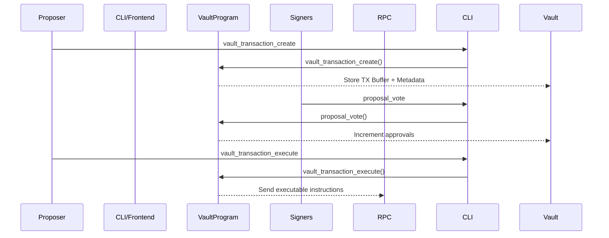
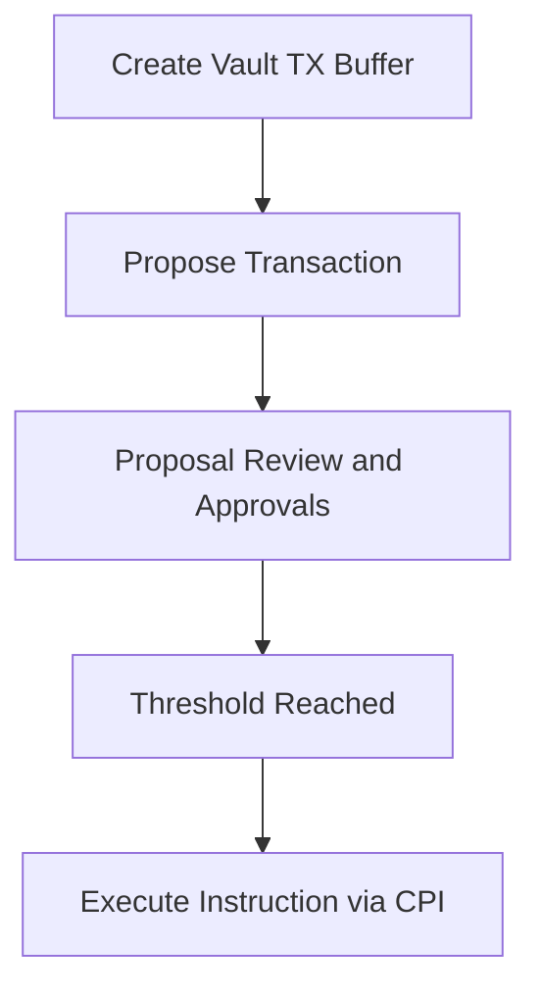

# Title: Verified Lifecycle + Signer Role Breakdown

---

### 📌 Overview

Squads V4 implements a multisig vault architecture enabling programmable asset and authority control. Key primitives include:

- **Vaults**: Each vault is a container for on-chain authority and asset management.
- **Transactions**: Proposals containing one or more instructions.
- **Proposals**: Special config transactions (e.g., signer rotation, program upgrades).
- **Execution Flow**: Explicit threshold signatures needed before executing any action.

---

## 🧠 Verified Lifecycle: Source-Linked Flow

---

## 🔄 Transaction Lifecycle (Source-Specific)

| Step | Action                              | GitHub Ref                                                                                                                                                       | Notes                              |
| ---- | ----------------------------------- | ---------------------------------------------------------------------------------------------------------------------------------------------------------------- | ---------------------------------- |
| 🆕 1 | `vault_transaction_create`          | [`vault_transaction_create.rs`](https://github.com/Squads-Protocol/v4/blob/main/cli/src/command/vault_transaction_create.rs)                                     | Used to propose a transaction      |
| 📦 2 | TX stored in buffer                 | [`transaction_buffer_create.rs`](https://github.com/Squads-Protocol/v4/blob/main/programs/squads_multisig_program/src/instructions/transaction_buffer_create.rs) | Raw tx is staged                   |
| 👀 3 | Signers approve via `proposal_vote` | [`proposal_vote.rs`](https://github.com/Squads-Protocol/v4/blob/main/programs/squads_multisig_program/src/instructions/proposal_vote.rs)                         | Signature recorded                 |
| 🔐 4 | Threshold logic validated           | [`vault_transaction_execute.rs`](https://github.com/Squads-Protocol/v4/blob/main/programs/squads_multisig_program/src/instructions/vault_transaction_execute.rs) | Cannot execute until M-of-N signed |
| 🚀 5 | Final `vault_transaction_execute`   | [`vault_transaction_execute.rs`](https://github.com/Squads-Protocol/v4/blob/main/cli/src/command/vault_transaction_execute.rs)                                   | Sends CPI to on-chain target       |

---

## 🔗 Supporting Config Ops

| Purpose                    | CLI Instruction                                            | On-Chain Logic                                                                                                                                                   |
| -------------------------- | ---------------------------------------------------------- | ---------------------------------------------------------------------------------------------------------------------------------------------------------------- |
| Add signer / change config | `config_transaction_create` + `config_transaction_execute` | [`config_transaction_create.rs`](https://github.com/Squads-Protocol/v4/blob/main/programs/squads_multisig_program/src/instructions/config_transaction_create.rs) |
| Add spending limit         | `multisig_add_spending_limit.rs`                           | [Link](https://github.com/Squads-Protocol/v4/blob/main/programs/squads_multisig_program/src/instructions/multisig_add_spending_limit.rs)                         |
| Program upgrades           | `initiate_program_upgrade.rs`                              | [`program_config.rs`](https://github.com/Squads-Protocol/v4/blob/main/programs/squads_multisig_program/src/instructions/program_config.rs)                       |

---

## 📁 PDA & Account Mapping

| Account             | Type | Purpose                                                            |
| ------------------- | ---- | ------------------------------------------------------------------ |
| `Vault`             | PDA  | Main control object storing signer set, threshold, vault authority |
| `TransactionBuffer` | PDA  | Stores serialized transaction data                                 |
| `Proposal`          | PDA  | Proposal metadata, description, versioning                         |
| `Instruction`       | PDA  | Actual CPI instructions                                            |

---

## 🧠 New Diagrams

### Transaction Lifecycle Summary

